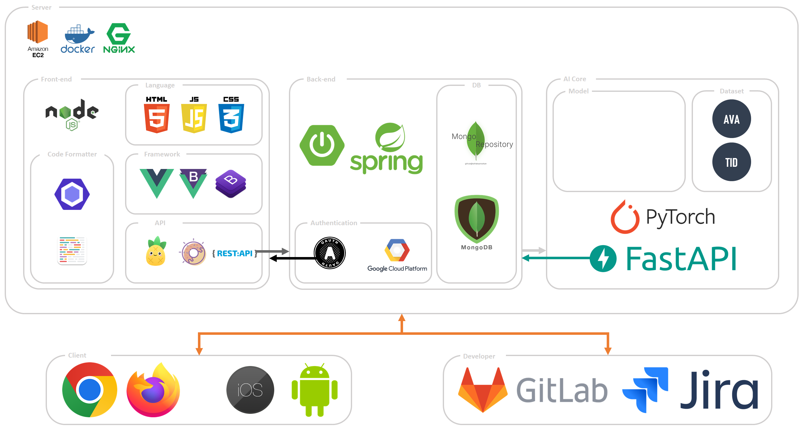
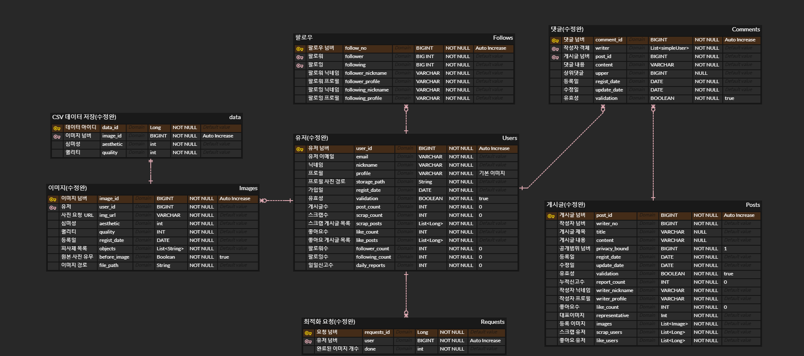
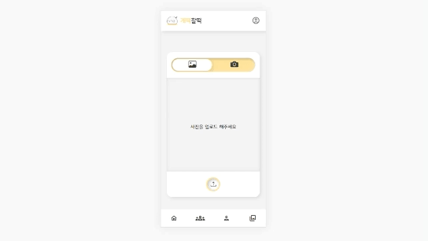
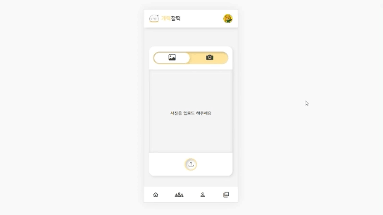
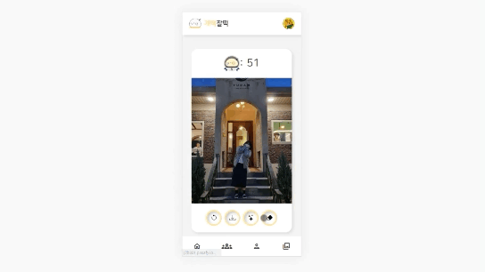
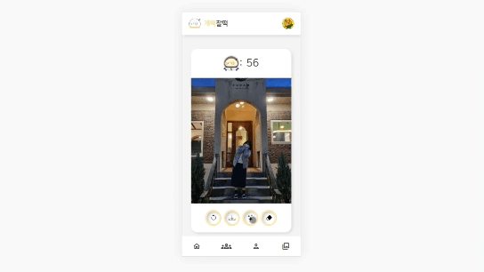
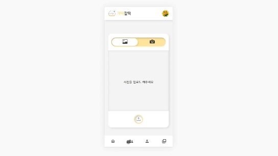
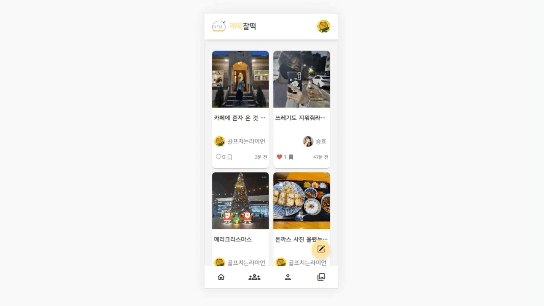

# Project

- [**Notion**](https://www.notion.so/a58ba04e32814a97833e532872ca07cb)
- [**Figma**](https://www.figma.com/file/3ucdqCdz2EGjXKt7OhhH5h/%EA%B0%9C%EB%96%A1%EC%B0%B0%EB%96%A1?node-id=0%3A1)
- [**UCC**](https://youtu.be/8_A7nKlzGqE)

# ℹ️ 프로젝트 소개

<aside>
💡 개선된 사진을 제공하는 AI Retouching 서비스

</aside>

개떡찰떡은 AI 모델을 활용하여 사용자의 사진을 평가합니다. 그리고 AI 모델을 활용한 사진 개선 서비스로 물체를 지우거나 필터를 적용해 사진을 예쁘게 바꿔보세요!

# 📅 일정 및 팀원 소개

### 일정 : **2022. 08. 29 ~ 2022. 10. 07 (6주)**

### 팀원 소개 : 총 6명

- 고승효[AI] : 팀장
- 김애리[BE] : 팀원, BE 파트장
- 노정현[AI] : 팀원, AI 파트장
- 장종환[BE] : 팀원
- 박준혁[FE] : 팀원
- 홍성덕[FE] : 팀원, FE 파트장

# 💻 기술 스택

> Front-End

- vue3 3.2.13
- vue-router 4.0.3
- node.js 8.13.2

> Back-End

- Java 1.8
- Spring-boot 2.7.4
- MongoDB 5.0.12

> AI

- Python 3.8.13
- PyTorch 1.12.1
- Jupyter Lab 3.4.5
- FastAPI 0.84.0
- Numpy 1.23.3
- OpenCV 4.6.0.66
- pydantic 1.10.2
- scipy 1.9.1

> 배포

- Ubuntu 20.04.1 LTS
- Docker 20.10.18
- Docker Compose 1.29.0
- Jenkins LTS
- Nginx

> IDE

- Intellij 2022. 1. 3
- VSCode 1.70.0

# **🏗️** 아키텍쳐

# 💽 ERD

# 🤖 이미지 평가 및 개선 모델

### Image Scoring : [Nima](https://github.com/idealo/image-quality-assessment)

### Object Detection : [Yolo v7](https://github.com/WongKinYiu/yolov7)

### Image Enhancement : [MIRNetv2](https://github.com/swz30/MIRNetv2), [Image-Contrast Enhancement](https://github.com/AndyHuang1995/Image-Contrast-Enhancement)

### Image Inpainting : [LaMa](https://github.com/saic-mdal/lama)

# 🗒️ 주요 기능

- 로그인
  - Google API를 활용한 소셜 로그인
    
- 사진 업로드
  - 저장된 사진 혹은 카메라를 활용한 사진 업로드
    
- 사진 분석
  - 학습한 NIMA 모델을 활용한 사진 평가 기능 제공
    
  - Yolo v7 모델을 활용한 객체 탐지
    
- 사진 보정
  - 탐지된 객체들의 좌표를 이용하여 LaMa 모델로 객체 지우기
    
  - 히스토그램 기반의 이미지 개선 기술을 통한 사진 보정 기능 제공
    
- 사진첩

  - 보정된 사진 중 마음에 드는 사진을 사진첩에 저장
  - DB에 저장된 사진들을 받아 사진첩 탐색
    

- 커뮤니티 기능
  - 개인의 사진첩에 저장된 사진을 바탕으로 게시글 작성
    
  - 작성된 게시글 수정 기능 제공
    
  - 게시글 탐색 및 댓글 작성
    
  - 자신이 작성한 댓글 삭제
    
  - 좋아요/스크랩 기능으로 팔로우/팔로윙 기능 추가
    

# Docs

| Type      | Link                                                                                                            |
| --------- | --------------------------------------------------------------------------------------------------------------- |
| Figma     | [Link](https://www.figma.com/file/3ucdqCdz2EGjXKt7OhhH5h/%EA%B0%9C%EB%96%A1%EC%B0%B0%EB%96%A1?node-id=0%3A1)    |
| WBS       | [Link](https://docs.google.com/spreadsheets/d/1vI2nZP5mbR0at0AT3ZI8VDgFU5no_Bu5MFk8tqqZvac/edit#gid=2074670185) |
| FE 명세서 | [Link](https://docs.google.com/spreadsheets/d/1vI2nZP5mbR0at0AT3ZI8VDgFU5no_Bu5MFk8tqqZvac/edit#gid=1365448865) |
| BE 명세서 | [Link](https://docs.google.com/spreadsheets/d/1vI2nZP5mbR0at0AT3ZI8VDgFU5no_Bu5MFk8tqqZvac/edit#gid=347993925)  |
| AI 명세서 | [Link](https://docs.google.com/spreadsheets/d/1vI2nZP5mbR0at0AT3ZI8VDgFU5no_Bu5MFk8tqqZvac/edit#gid=1082957846) |
